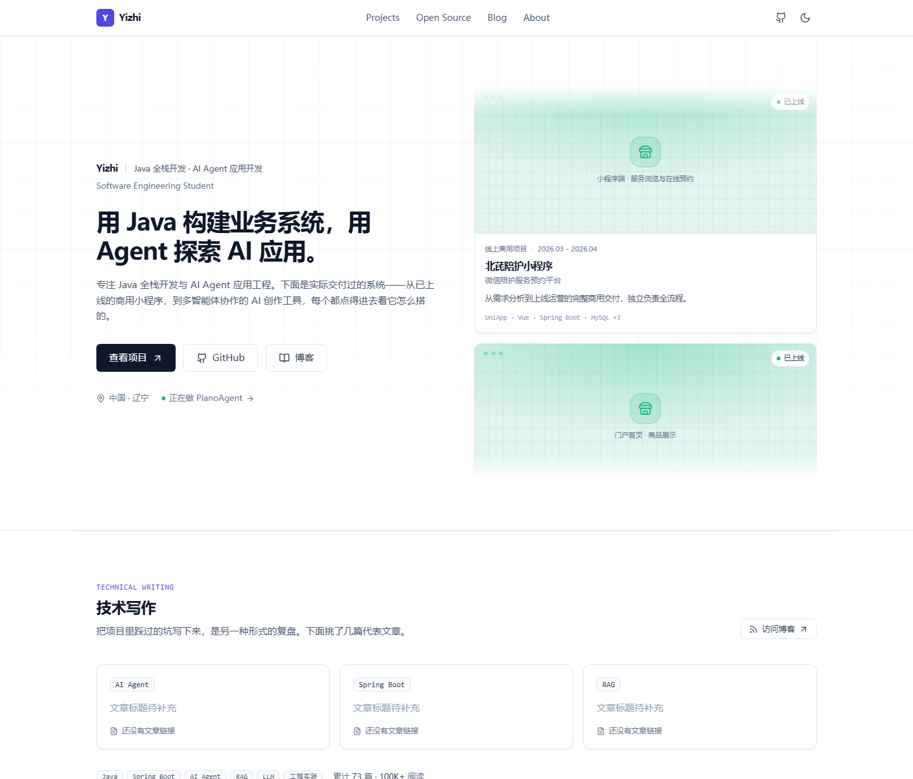
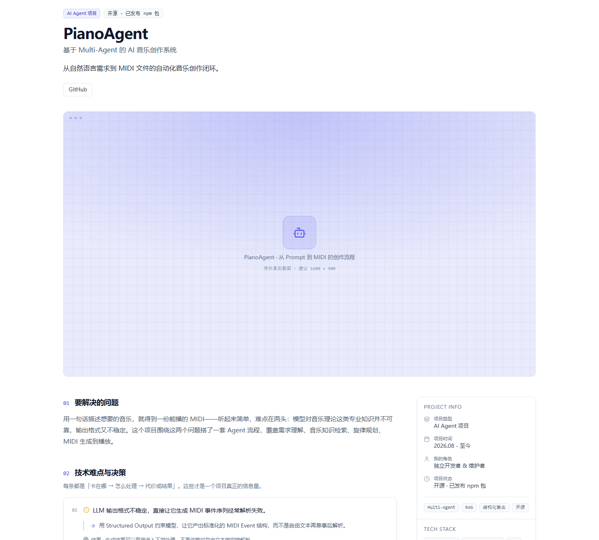
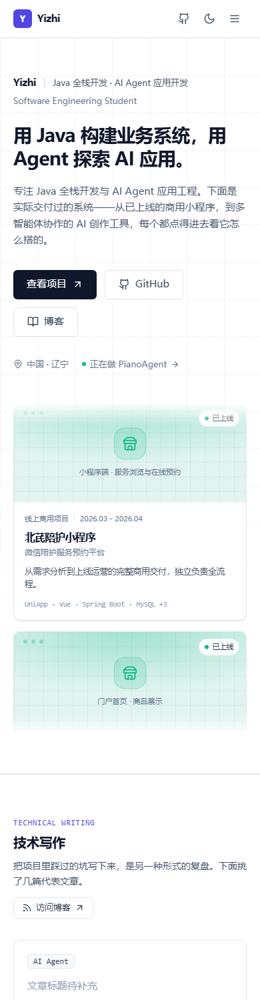

# Yizhi | Java 全栈开发 · AI Agent

个人技术作品集网站。纯前端静态站点，**不依赖任何后端服务 / 数据库 / 登录系统**，`npm run build` 后可直接部署到 GitHub Pages。

> 用 Java 构建业务系统，用 Agent 探索 AI 应用。



<details>
<summary>更多预览（项目详情页 / 移动端）</summary>

**项目详情页（case study 结构）**



**移动端**



</details>

---

## 目录

- [技术栈](#技术栈)
- [快速开始](#快速开始)
- [项目目录结构](#项目目录结构)
- [如何修改个人信息](#如何修改个人信息)
- [如何修改项目数据](#如何修改项目数据)
- [如何添加博客文章](#如何添加博客文章)
- [需要你替换的内容](#需要你替换的内容)
- [部署到 GitHub Pages](#部署到-github-pages)
- [内容结构：这是作品集，不是简历](#内容结构这是作品集不是简历)
- [设计说明](#设计说明)
- [常见问题](#常见问题)

---

## 技术栈

| 分类 | 选型 |
| --- | --- |
| 框架 | Vue 3（`<script setup>` 组合式 API） |
| 语言 | TypeScript（`strict: true`） |
| 构建 | Vite 5 |
| 样式 | Tailwind CSS 3（`darkMode: 'class'`） |
| 图标 | lucide-vue-next（按需引入，可 tree-shaking） |
| 路由 | Vue Router 4（HTML5 History 模式） |
| 部署 | GitHub Pages + GitHub Actions |

没有任何多余的大型依赖：**没有引入 UI 组件库、动画库、状态管理库、请求库**。全站总 gzip 体积约 70 KB。

---

## 快速开始

环境要求：Node.js ≥ 18（推荐 20 / 22）。

```bash
# 1. 安装依赖
npm install

# 2. 启动开发服务器（默认 http://localhost:5173）
npm run dev

# 3. 生产构建（会先跑 TypeScript 类型检查，再打包到 dist/）
npm run build

# 4. 本地预览生产构建产物
npm run preview

# 单独跑类型检查
npm run typecheck
```

---

## 项目目录结构

```
.
├── .github/workflows/deploy.yml   # GitHub Actions 自动部署（推到 main 即上线）
├── docs/                          # README 用的预览截图
├── public/
│   ├── avatar.png                 # 头像：导航栏 / 页脚 / 标签页图标共用同一张
│   └── og-image.svg               # 社交分享封面（建议后续换成 1200×630 的 PNG）
├── src/
│   ├── components/
│   │   ├── home/                  # 首页各板块
│   │   │   ├── HeroSection.vue        首屏（左边简介 + 右边项目流）
│   │   │   ├── ProjectStream.vue      ★ 首屏右侧：上下流动的项目卡片（单列无缝循环）
│   │   │   ├── WritingTeaser.vue      技术写作
│   │   │   └── ContactCta.vue         联系入口
│   │   ├── layout/
│   │   │   ├── AppHeader.vue          顶部导航（sticky + 毛玻璃 + 移动端汉堡菜单）
│   │   │   └── AppFooter.vue          页脚
│   │   └── ui/                    # 通用组件
│   │       ├── BaseButton.vue         按钮（支持内部路由 / 外链 / 普通按钮）
│   │       ├── SmartLink.vue          链接（自动识别 TODO 占位符，不会产生假链接）
│   │       ├── StreamCard.vue         ★ 流动里的大卡片（封面在上 + 名称 + 一句话 + 技术栈）
│   │       ├── WorkCard.vue           项目列表页卡片（封面在上，整张卡可点）
│   │       ├── CoverFrame.vue         ★ 作品封面框（真图 / 装饰封面 / 尺寸占位框 三态）
│   │       ├── DecisionList.vue       技术难点与决策列表（问题 → 做法 → 代价/结果）
│   │       ├── FlowDiagram.vue        架构流程图（按节点数量自适应横/纵）
│   │       ├── SectionHeading.vue     区块标题
│   │       └── TechTag.vue            技术栈标签
│   ├── composables/
│   │   ├── useTheme.ts               明暗主题切换（localStorage 持久化）
│   │   └── useSeo.ts                 路由级 title / description / OG 同步
│   ├── data/                     ★ 所有内容都在这里，改内容不用碰组件
│   │   ├── profile.ts                个人资料、导航、时间线、奖项、联系方式
│   │   ├── projects.ts               作品数据（含封面、架构图、技术决策）
│   │   ├── openSource.ts             开源项目数据
│   │   ├── blog.ts                   博客统计、分类、代表文章
│   │   ├── skills.ts                 技能清单
│   │   └── placeholders.ts           TODO 占位符定义与判定工具
│   ├── directives/reveal.ts      v-reveal 滚动揭示指令
│   ├── router/index.ts           路由表
│   ├── types/index.ts            全部类型定义
│   ├── views/                    页面
│   │   ├── HomeView.vue              /
│   │   ├── ProjectsView.vue          /projects
│   │   ├── ProjectDetailView.vue     /projects/:slug（数据驱动，新增项目无需改路由）
│   │   ├── OpenSourceView.vue        /open-source
│   │   ├── BlogView.vue              /blog
│   │   ├── AboutView.vue             /about
│   │   └── NotFoundView.vue          404
│   ├── App.vue
│   ├── main.ts
│   └── style.css                 Tailwind 入口 + 设计令牌 + 基础样式
├── index.html                    SEO meta、主题初始化、SPA 路径还原
├── tailwind.config.js            配色 / 字体 / 动画
├── vite.config.ts                base 解析 + GitHub Pages 404 回退插件
└── tsconfig.json
```

**核心约定：数据与 UI 完全分离。** 组件只负责渲染，所有文案与链接都来自 `src/data/`。要改内容，基本只需要动 `src/data/`。

---

## 如何修改个人信息

打开 `src/data/profile.ts`：

```ts
export const profile: Profile = {
  brand: 'Yizhi',                  // 导航栏左上角的站点名
  name: '赵伟',
  headline: 'Java 全栈开发 · AI Agent 应用开发',
  headlineEn: 'Software Engineering Student',
  title: '用 Java 构建业务系统，用 Agent 探索 AI 应用。',   // 首屏主标题
  subtitle: '专注 Java 全栈开发……',                        // 首屏副标题
  location: '中国 · 辽宁',
  email: '1910693646@qq.com',
  jobTarget: 'JAVA 全栈开发',
  github: 'https://github.com/YoyuDev',
  blog: 'https://blog.csdn.net/hahai_',
}
```

同一个文件里还有：

| 变量 | 作用 |
| --- | --- |
| `navItems` | 顶部导航项 |
| `timeline` | 教育背景与实习经历（About 页使用） |
| `awards` | 荣誉奖项（About 页使用） |
| `contactLinks` | About 页的联系方式列表 |

> **隐私提醒**：手机号等敏感信息**没有**放进代码。公开站点建议只保留邮箱与社交主页。如需添加，改 `contactLinks` 即可。

首屏那三个按钮也全部读这里的数据，改字段即可，不用动组件：

| 按钮 | 数据来源 |
| --- | --- |
| 查看项目 | 固定跳站内 `/projects` |
| GitHub | `profile.github` |
| 博客 | `profile.blog` |

技能清单在 `src/data/skills.ts`，按 `skillGroups` 数组组织，加一组技术就是往数组里加一项。

---

## 如何修改项目数据

全部在 `src/data/projects.ts`。**新增项目不需要改任何组件或路由**——详情页走 `/projects/:slug` 通配，列表页、首页都会自动带上。

```ts
{
  slug: 'my-new-project',        // 路由地址：/projects/my-new-project
  name: '项目名称',
  subtitle: '一句话副标题',
  tagline: '卡片上的一句话描述',
  type: 'ai-agent',              // 'commercial' | 'ai-agent' | 'competition'
  typeLabel: 'AI Agent 项目',     // 类型徽标文案
  period: '2026.01 - 2026.02',
  role: '独立开发者',
  status: '已上线',               // 可选
  highlights: ['重点标签1', '重点标签2'],
  summary: '项目简介……',
  techStack: ['Spring Boot', 'Vue3', 'MySQL'],

  // ★ 作品封面：作品集的视觉证据
  shots: [
    { src: '/shots/my-project-home.png', caption: '首页 · 商品展示' },
    { caption: '管理后台 · 订单处理' },          // 还没图，先占位
  ],

  // ★ 技术难点与决策：整页的重心，建议每个项目写 2-4 条
  decisions: [
    {
      problem: '卡在哪 / 约束是什么',
      approach: '实际怎么处理的',
      tradeoff: '这么做的代价（可选，但写了最加分）',
      result: '结果或怎么验证（可选）',
    },
  ],

  features: [                    // 功能范围
    { title: '功能名', description: '功能说明' },
  ],
  architecture: [                // 系统架构（可多组，每组画一张流程图）
    {
      title: '整体链路',
      caption: '可选说明',
      nodes: [
        { id: 'user', label: 'User', kind: 'input' },
        { id: 'api', label: 'Spring Boot', detail: 'RESTful API', kind: 'agent' },
        { id: 'db', label: 'MySQL', kind: 'data' },
        { id: 'out', label: 'Result', kind: 'output' },
      ],
    },
  ],
  implementations: [             // 关键实现
    { title: '技术点', description: '实现说明' },
  ],
  outcomes: ['交付产出1', '交付产出2'],
  links: [
    { label: 'GitHub', url: 'https://github.com/...', kind: 'github' },
  ],
  sourceNote: '商业项目｜源码不公开',   // 可选：没有公开链接时展示的说明
  building: true,                // 可选：是否出现在首页 Hero 的「正在做」
}
```

### 作品封面怎么加

1. 把图片放进 `public/shots/`（该目录需自己创建）
2. `shots[0].src` 写 `/shots/文件名.png`

`shots[0]` 是封面（列表页卡片、首屏流动卡片、详情页首屏共用），其余会排在详情页封面下面当补充图。

**三种状态**（由 `CoverFrame.vue` 决定，不用手动切）：

| 情况 | 渲染成什么 |
| --- | --- |
| 填了 `src` | 真实图片（懒加载），铺满并裁切 |
| 没填 `src`，但项目有 `type` | **装饰封面**：按项目类型着色 + 细网格 + 类型图标 + 图注。一眼能看出是插画而不是截图 |
| 既没 `src` 也没 `type` | 斜纹占位框 + 建议分辨率 |

比例用 `ratio` 控制，支持 `'16/9'`（默认）、`'21/9'`、`'4/3'`、`'3/2'`、`'1/1'`。
**建议出图统一 16:9、宽度 1600px 左右**——首屏流动卡片会强制用 21:9，`object-cover` 会自动裁切，所以按 16:9 出图不会浪费。

> 详情页的大封面在没图时会多显示一行「待补真实截图 · 建议 1600 × 900」，就是为了提醒你该往这里补图。
> 图补上之后装饰封面和占位框都不会再出现。

### 技术难点与决策怎么写

这是作品集和简历真正的分水岭。简历写「实现了 XXX 功能」，这里要写**卡在哪 → 怎么处理 → 代价是什么**。

写之前问自己三个问题：

- 这个项目里最让我头疼的是什么？（那就是 `problem`）
- 我最后是怎么绕过去或解决的？（`approach`）
- 这么做的代价是什么？我放弃了什么方案？（`tradeoff`）

**没想清楚的那条宁可不写**——空着比写废话好。面试官真正会追问的就是这一段。

**架构图节点类型**（`kind`）决定配色：

| kind | 含义 | 样式 |
| --- | --- | --- |
| `input` | 输入 | 白色描边 |
| `agent` | 智能体 / 服务 | 蓝紫底色 + 呼吸高亮 |
| `data` | 数据 / 检索层 | 虚线描边 |
| `output` | 最终产物 | 深色填充 |

节点数 ≤ 4 时桌面端横向排列，> 4 自动改为纵向管线，移动端一律纵向——所以**不需要担心架构图在窄屏被裁切**。

开源项目数据在 `src/data/openSource.ts`，结构类似。

---

## 如何添加博客文章

`src/data/blog.ts` 里有两部分：

1. **`blogCategories`**：写作方向分类，直接改数组即可。
2. **`featuredPosts`**：代表文章。目前是占位状态：

```ts
export const featuredPosts: BlogPost[] = [
  {
    id: 'post-1',
    title: 'TODO_ARTICLE_TITLE_1',        // ← 换成真实标题
    url: PLACEHOLDERS.ARTICLE,            // ← 换成真实文章链接
    category: 'AI Agent',
    placeholder: true,                    // ← 填好真实内容后删掉这一行
  },
]
```

把 `title` / `url` 换成真实内容、删掉 `placeholder: true` 之后，卡片就会变成可点击的真实文章链接。**填之前它会显示为「待补充」状态，不会生成假链接。**

博客主页地址是真实的（`https://blog.csdn.net/hahai_`），`blogStats` 里的文章数与浏览量也直接改这里即可。

---

## 需要你替换的内容

站点遵循一条硬规则：**没有真实地址就绝不伪造 URL**，一律用 `TODO_*` 占位符，UI 会自动把它渲染成灰显的「待补充」状态。封面图同理——没图就渲染占位框，不放假图。

| 位置 | 当前值 | 说明 |
| --- | --- | --- |
| **所有项目的作品封面** | 占位框 | ★ **最该优先补的**，见上方「作品封面怎么加」 |
| `index.html` → `og:url` | 构建期自动填 | 不用手改——构建时按 `GITHUB_REPOSITORY` 推导出真实站点地址；绑自定义域名时设 `SITE_URL` 变量覆盖，见「部署到 GitHub Pages」第 5 步 |
| `src/data/projects.ts` → PianoAgent 的 `NPM` 链接 | `TODO_NPM_URL` | npm 包地址 |
| `src/data/openSource.ts` → PianoAgent 的 `NPM` 链接 | `TODO_NPM_URL` | 同上 |
| `src/data/blog.ts` → `featuredPosts` | `TODO_ARTICLE_TITLE_1..3` / `TODO_ARTICLE_URL` | 代表文章标题与链接 |
| 各项目的 `decisions` 措辞 | 已按真实信息写好 | **建议通读一遍**，把只有你知道的细节补进去 |

**已经填好真实地址、不需要替换的**：

- GitHub 主页 `https://github.com/YoyuDev`
- 博客主页 `https://blog.csdn.net/hahai_`
- PianoAgent `https://github.com/YoyuDev/PianoAgent`
- SoulAgent `https://github.com/YoyuDev/SoulAgent`
- dsh-ping `https://github.com/YoyuDev/dsh-ping`

**刻意不放链接的**（已在详情页注明「源码不公开」）：

- 北芪陪护小程序（商业项目）
- 对外贸易公司门户网站（商业项目）
- 多智能体协同个性化教育资源生成平台（竞赛项目）

后续如果开源了，只要在对应项目的 `links` 数组里加一条即可。

---

## 部署到 GitHub Pages

> 全程约 5 分钟。**仓库必须是 public**——GitHub Free 只能从公开仓库发布 Pages，private 仓库要 Pro。

### 第 1 步：创建仓库

在 GitHub 上新建仓库，只有两点要注意：

- **Visibility 选 Public**
- **不要**勾选 "Add a README file" / `.gitignore` / `license`
  ——本地已经有这些文件了，勾上会让首次推送直接冲突

### 第 2 步：先把发布源设成 GitHub Actions

> ⚠️ **这一步要在推送之前做。** 顺序反了的话，第一次 workflow 会在部署环节报
> `Pages is not enabled` 而失败——不是配错了，设置完重跑一次就好，但容易白慌一场。

进入仓库 **Settings → Pages**，把 **Build and deployment → Source** 改成 **GitHub Actions**。

选完 GitHub 会推荐几个 workflow 模板，**直接跳过**——`.github/workflows/deploy.yml` 已经写好了。

> 只需要改这一处。**不需要**选 "Deploy from a branch"，也不需要手动创建 `gh-pages` 分支。

### 第 3 步：推送

```bash
git init -b main
git add .
git commit -m "feat: 初始化个人作品集网站"
git remote add origin https://github.com/YoyuDev/<你的仓库名>.git
git push -u origin main
```

> 老版本 git 不认 `git init -b main`，那就 `git init` 之后再 `git branch -M main`。

### 第 4 步：等待自动部署

`.github/workflows/deploy.yml` 已经配好：只要推送到 `main`（或在 Actions 页面手动触发），它就会自动：

1. 检出代码 → 安装 Node 20 → `npm ci` → `npm run build`
2. 自动计算部署子路径并注入 `VITE_BASE_PATH`
3. 上传 `dist` 并发布到 GitHub Pages

到仓库 **Actions** 标签页看进度（首次约 1–2 分钟），完成后访问地址是：

```
https://<用户名>.github.io/<仓库名>/
```

> **base 路径是自动算的**：仓库名不叫 `<用户名>.github.io` 时会自动用 `/<仓库名>/`，叫 `<用户名>.github.io` 时自动用 `/`。所以仓库叫什么都不用手改配置。

### 第 5 步：站点地址（默认不用管）

**正常部署不用做任何事**。构建时会按 Actions 自动注入的 `GITHUB_REPOSITORY` 推导出站点地址，写进
`og:url` / `og:image` / `canonical`：

| 仓库名 | 推导出的地址 |
| --- | --- |
| `<用户名>.github.io` | `https://<用户名>.github.io/` |
| `<仓库名>` | `https://<用户名>.github.io/<仓库名>/` |

> ⚠️ 这几个 meta 必须**在构建期**写进 HTML —— 微信、QQ 的爬虫**不执行 JS**，只在运行时改 DOM
> 是没用的。所以本地构建（拿不到 `GITHUB_REPOSITORY`）时 `og:url` 会被整条删掉，
> 宁可不写也不发一个假地址。想在本机复现线上的产物：
> `GITHUB_REPOSITORY=用户名/仓库名 npm run build`（PowerShell 用 `$env:GITHUB_REPOSITORY="用户名/仓库名"`）。

**只有这两种情况需要手动指定**（部署到别处 / 绑了自定义域名）：

仓库 **Settings → Secrets and variables → Actions → Variables** → **New repository variable**：

| Name | Value |
| --- | --- |
| `SITE_URL` | 完整地址，如 `https://你的域名` |

设完回 **Actions** 重跑一次部署（选最近那次 run → **Re-run all jobs**）。显式变量优先级高于自动推导。

### 第 6 步（可选）：绑定自定义域名

1. 在域名服务商处添加 CNAME 解析，指向 `<用户名>.github.io`。
2. 仓库 **Settings → Pages → Custom domain** 填上域名并保存（GitHub 会自动生成 CNAME 文件）。
3. 勾选 **Enforce HTTPS**。
4. 回到 **Settings → Secrets and variables → Actions → Variables**，把变量改成：
   - `BASE_PATH` = `/`
   - `SITE_URL` = `https://你的域名`

然后重新跑一次部署（往 main 推一次提交即可）。绑定自定义域名后站点在根路径，所以 `BASE_PATH` 必须是 `/`。

### 第 7 步（可选）：本地模拟子路径构建

想在本机验证子路径部署是否正确：

```bash
# Windows (PowerShell)
$env:VITE_BASE_PATH="/你的仓库名/"; npm run build; npm run preview

# macOS / Linux
VITE_BASE_PATH=/你的仓库名/ npm run build && npm run preview
```

### 部署踩过的坑

- **push 被拒，报 `GH007: Your push would publish a private email address`**
  GitHub 账号开了「阻止暴露邮箱的命令行推送」，但本地 git 的 `user.email` 还是真实邮箱。
  解法：`git config --global user.email "<你的ID>+<用户名>@users.noreply.github.com"`
- **deploy 环节失败，提示 `Pages is not enabled`**：第 2 步没做，或者做在推送之后了。补上再重跑。
- **部署成功但页面是旧的**：浏览器缓存，`Ctrl+Shift+R` 硬刷。
- **直接刷新子页面 404**：`dist/404.html` 没生成。检查 `vite.config.ts` 的 `spa404Fallback` 插件，
  以及 `index.html` 里的还原脚本是否被删——这两处必须成对存在。

### 刷新 404 是怎么处理的

GitHub Pages 是纯静态托管，没有服务端 rewrite。所以 `vite.config.ts` 里内置了一个构建插件，会在打包结束时额外生成 `dist/404.html`：访问 `/projects/piano-agent` 这类前端路由时，服务器返回 404 → `404.html` 把原始路径通过 query 带回 `index.html` → `index.html` 里的还原脚本用 `history.replaceState` 恢复路径 → 路由正常渲染。

**这两处必须成对存在**（`vite.config.ts` 的 `spa404Fallback` 插件 + `index.html` 里的还原脚本）。如果把它们删掉，直接刷新子路由就会 404。

---

## 内容结构：这是作品集，不是简历

这个站点的组织逻辑是**作品集**，不是简历的网页版。两者差别很大，改内容时请沿着作品集的逻辑走：

| | 简历的写法 | 作品集的写法（本站采用） |
| --- | --- | --- |
| 主角 | 我（学历 / 经历 / 奖项 / 技能） | 作品（做出来什么、能跑吗、怎么做的） |
| 内容 | 结论式罗列，「独立完成交付」 | 过程与证据，卡在哪、怎么解、代价是什么 |
| 证据 | 自述 | 可验证产物：仓库、npm 包、部署地址、界面截图 |
| 单位 | 一段经历 | 一个 case study |

具体落地：

- **首页** = Hero（左边简介 + **右边上下流动的作品卡片**）+ 技术写作 + 联系。没有「数字看板」「技能罗列」——那些是简历语言。首屏不摆方法论，直接把作品铺出来。
- **项目详情页** = case study：封面 → 要解决的问题 → **技术难点与决策** → 系统架构 → 关键实现 → 功能范围 → 交付产出。「我的角色 / 项目时间」降级到右侧栏当元信息。
- **`decisions` 字段是整站最重要的内容**。写不出「代价」说明还没想透；想不透的那条宁可不写。
- 荣誉奖项、教育背景、实习经历留在 About 页，不作为首页正文。

### 首屏那个流动是怎么做的

`ProjectStream.vue` 里只放一列，轨道（`.stream-track`）里塞**两份等高的卡片**，位移一半（`translateY(0)` → `-50%`）正好首尾相接，看不出接缝。第二份对辅助技术 `aria-hidden` + `inert`，不会重复读屏也不会被点到。

几个刻意的点，改的时候别踩：

- **每张卡必须等高**，否则接缝处会跳。卡片里所有文字行都固定行数（`truncate` / `line-clamp-2`），加内容时留意。
- **悬停整体暂停**（`.stream-viewport:hover .stream-track`），不然想点某个项目时它一直在跑。
- **上下用 mask 渐隐**，卡片是淡入淡出而不是被硬边切断。渐隐范围在 `.stream-viewport` 的 `mask-image` 里，`7% / 93%`。
- **`prefers-reduced-motion` 下必须显式 `animation: none`**，只靠全局的 `animation-duration: 0.001ms` 会让动画瞬间跑完停在 `-50%` 的位置，看起来像内容被顶掉了。同时把复制那一份 `display: none`。
- 卡片封面固定用 **21:9**（`ratio="21/9"`）。卡片是竖排结构，16:9 会把单张卡撑得过高，视口里连一张完整卡都放不下。

---

## 设计说明

- **风格**：极简、技术感、克制。参考 Linear / Vercel / GitHub 的信息密度与边框处理，没有大面积渐变、没有粒子、没有 WebGL、没有鼠标跟随。
- **配色**：白色 / 极浅灰打底，正文用黑与深灰，唯一的 Accent 是克制的蓝紫（`brand.500 = #6366f1`），只在关键交互元素上出现。卡片用 1px 细边框 + 极轻阴影，圆角 10px。
- **字体**：纯系统字体栈（`Inter → system-ui → -apple-system → Segoe UI → PingFang SC → Microsoft YaHei`），**零外部字体请求**，首屏最快。想换成网络字体只需在 `index.html` 引入，并把字体名加到 `tailwind.config.js` 的 `fontFamily.sans` 最前面。
- **明暗主题**：`darkMode: 'class'`，首次访问跟随系统偏好，手动切换后写入 `localStorage`。主题初始化脚本内联在 `index.html` 的 `<head>` 里，避免暗色模式闪白。
- **动画**：只保留四种轻量动效——首屏淡入、卡片 hover 位移、滚动 reveal、首屏作品卡片垂直循环流动，另加架构图节点的呼吸式高亮。全部尊重 `prefers-reduced-motion`。
- **占位不造假**：没提供真实链接的位置用 `TODO_*` 占位符渲染成「待补充」，没提供封面图的位置渲染成按项目类型着色的装饰封面（详情页会额外标注建议尺寸）。**全站不存在任何假链接或假图。**
- **响应式**：桌面内容最大宽度 1200px；移动端单列，导航折叠成汉堡菜单；所有断点（390 / 768 / 1024 / 1440 / 1920）实测零横向溢出。

---

## 常见问题

**Q：`npm run build` 报 TypeScript 错误怎么办？**
构建脚本是 `vue-tsc --noEmit && vite build`，类型不过就不出包。可以单独跑 `npm run typecheck` 定位。项目开启了 `strict: true`。

**Q：改了 `src/data/` 里的内容，页面没变化？**
`npm run dev` 有热更新，保存即生效，不需要重启。如果没反应，刷新一下浏览器。

**Q：部署后样式全丢 / 资源 404？**
基本是 `base` 不对。检查仓库名与 Actions 里的 `VITE_BASE_PATH`。如果绑了自定义域名，确认 Variables 里 `BASE_PATH` 设成了 `/`。

**Q：部署后直接刷新子页面 404？**
检查 `dist/` 里有没有 `404.html`。没有的话说明 `vite.config.ts` 的 `spa404Fallback` 插件被改动或删除了。

**Q：怎么改主题色？**
改 `tailwind.config.js` 里的 `brand` 色阶即可，全站会跟着变。

---

## 说明

站点内的所有项目经历、数据与链接均来自真实简历，未虚构任何项目、Demo、下载量或公司信息。

参与 DeepSeek Harness 开源生态并开发 `dsh-ping` 插件属于个人贡献，**不代表 DeepSeek 官方身份**。
